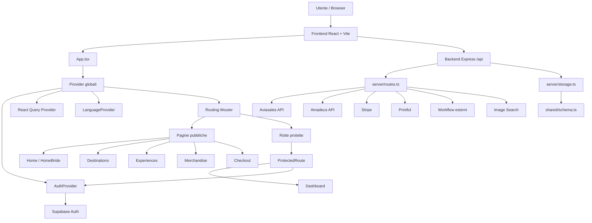

# Architettura ByeBi — progetto esame SAW

Questo documento sintetizza la struttura della versione pubblicata per la consegna dell'esame integrativo di Sviluppo Applicazioni Web.

## Visione generale

ByeBi è una web app full-stack composta da:

- frontend React/Vite;
- backend Express;
- autenticazione Supabase;
- storage/schema condiviso;
- integrazioni con API esterne.



## Frontend

Il frontend è sviluppato con React, TypeScript e Vite.

Il file centrale è:

```txt
client/src/App.tsx
```

Responsabilità principali:

- inizializzare i provider globali;
- gestire la scelta del brand (`ByeBro` / `ByeBride`);
- definire le rotte principali tramite Wouter;
- separare pagine pubbliche e dashboard privata.

## Autenticazione

L'autenticazione è gestita con Supabase Auth.

File principale:

```txt
client/src/hooks/use-auth.tsx
```

Responsabilità:

- recuperare la sessione corrente;
- ascoltare i cambiamenti di autenticazione;
- esporre `user`, `isLoading`, `isAuthenticated` e lo stato degli errori;
- fornire funzioni di login, registrazione e logout.

## Rotte protette

La dashboard è protetta tramite un componente dedicato:

```txt
client/src/lib/protected-route.tsx
```

Comportamento:

- se l'autenticazione è in caricamento, mostra uno stato di attesa;
- se l'utente non è autenticato, reindirizza alla pagina di login;
- se l'utente è autenticato, renderizza la pagina privata.

## Backend

Il backend è basato su Express.

File principali:

```txt
server/index.ts
server/routes.ts
```

Responsabilità:

- avvio del server;
- parsing JSON e form data;
- gestione webhook;
- registrazione rotte API;
- comunicazione con servizi esterni;
- risposta al frontend.

## API esterne

Il progetto contiene le seguenti integrazioni principali:

| Servizio | Uso nel progetto |
| --- | --- |
| Aviasales | Ricerca voli |
| Amadeus | Ricerca hotel |
| Supabase | Autenticazione utenti |
| Stripe | Pagamenti/webhook |
| Printful | Prodotti e merchandising |
| Workflow esterni | Automazioni opzionali tramite webhook |

Il flusso generale di comunicazione con i servizi esterni è:

```txt
Frontend -> richiesta HTTP -> backend Express -> servizio esterno -> risposta JSON -> rendering nel frontend
```

## Dati e schema condiviso

Lo schema dati si trova in:

```txt
shared/schema.ts
```

Contiene modelli e validazioni usati per mantenere coerente la struttura dei dati tra backend e frontend.

Lo storage lato server si trova in:

```txt
server/storage.ts
```

Le entità applicative sono gestite da `MemStorage`, un'implementazione in memoria
basata sui tipi definiti nello schema condiviso.

## Requisiti coperti

La versione d'esame comprende:

1. React come framework frontend;
2. routing lato client;
3. autenticazione utente;
4. rotta privata protetta;
5. backend Express;
6. almeno una chiamata API esterna;
7. repository pubblico con README e istruzioni di avvio.
